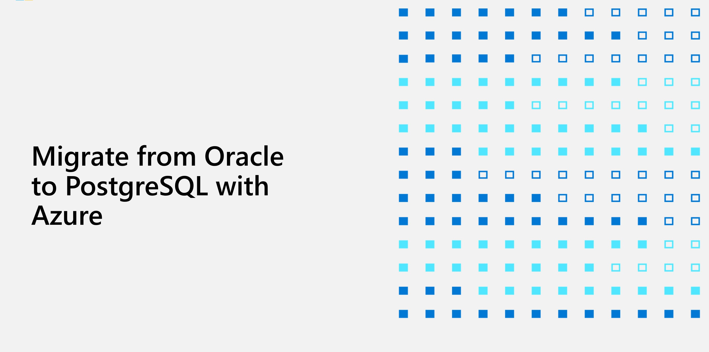

# Migrating Oracle to PostgreSQL

# Why Migrate from Oracle to Azure Database for PostgreSQL?
A common reason to migrate from Oracle to Azure Database for PostgreSQL is compatibility, because PostgreSQL PL/PGSQL is highly compatible with Oracle PL/SQL, which lowers the migration cost and risk. Azure also offers fully managed services for PostgreSQL (PaaS) to take advantage of all the key pieces that are part of the underlying Azure relational database platform. Azure provides the same level of reliability across all these platforms.

Microsoft's Azure Database for PostgreSQL is a fully managed PaaS that is highly available, secured, provides automatic backups, and is easily scalable. This means you can focus on building your PostgreSQL database application and let Azure do the heavy lifting of infrastructure management and security in the background.

Azure has also integrated machine learning capabilities for implementing additional security layers to flag any unusual database access pattern. Azure provides database backups for 35 days with to the point restoration.

With so many advantages and flexibility, it makes sense for companies to move their on-premises PostgreSQL database to Azure Database for PostgreSQL, which can be done seamlessly with minimal downtime using Azure Database Migration Service. This workshop also explains how to migrate an on-premises Oracle database to an Azure Database for PostgreSQL environment using this migration service with GitHub code.

In Postgres, you can target your Oracle migrations. If you have Oracle workloads that you want to migrate to Azure but you don't want to convert to a SQL based solution, Postgres is more compatible with the work in Oracle and with making some more clear migration patterns.

## Target auidence 

- SQL Developer
- Database Administrator

## Abstracts

### Workshop

In this workshop, you gain a better understanding of how to conduct a site analysis for a customer to compare cost, performance, and level of effort required to migrate from Oracle to PostgreSQL. This workshop has tailored database platform migration steps to assist you in this learning journey.  You will also design and build a proof of concept (POC) to help the customer take advantage of new PostgreSQL features to improve performance and resiliency.

After completing this workshop, you will be better able to conduct a site analysis to compare the cost, performance, and level of effort required to migrate from Oracle to PostgreSQL. 

## Azure services and related products
- Azure Database Migration Service (DMS)
- Azure Database for PostgreSQL
- ora2pg

## Help and Support

We welcome feedback and comments from Microsoft SMEs & learning partners who will deliver this.
